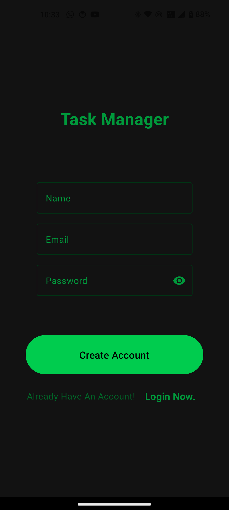
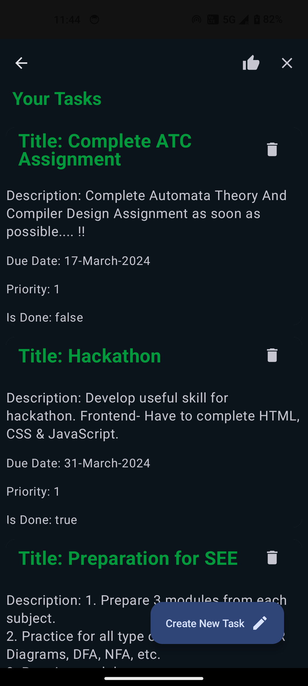
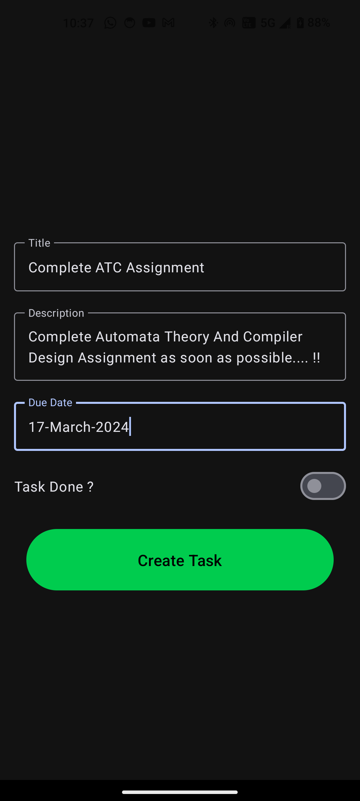
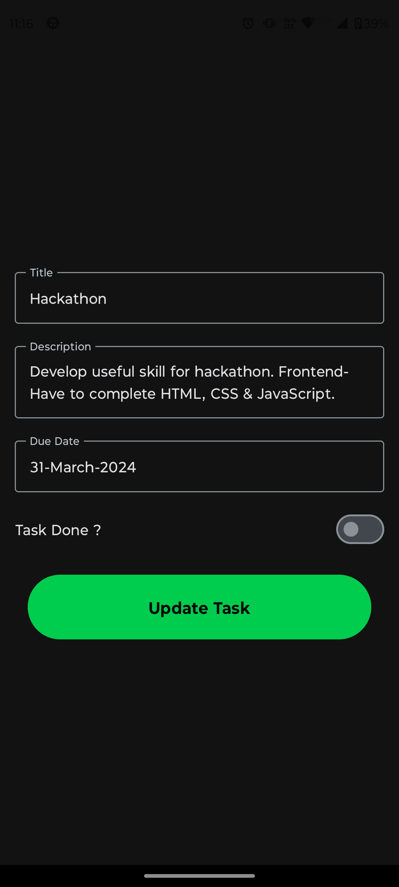

# DBMS Mini Project

Welcome to our DBMS mini project repository! 🎉

## Overview
This project is developed as a part of our DBMS subject. It aims to provide a comprehensive demonstration of a database management system using various technologies.

## Tech Stack
- **Backend**: [](https://ktor.io/)
- **Database**: [](https://www.sqlite.org/)
- **Android App**: [](https://kotlinlang.org/)
- **Web Frontend**: [](https://developer.mozilla.org/en-US/docs/Web/HTML) [](https://developer.mozilla.org/en-US/docs/Web/CSS) [](https://developer.mozilla.org/en-US/docs/Web/JavaScript)

## Features
- **Database Management**: CRUD operations using SQLite for storing and managing data.
- **Android Application**: An interactive mobile app built with Kotlin and Jetpack Compose, allowing users to interact with the database.
- **Web Interface**: A user-friendly web frontend implemented with HTML, CSS, and JS, providing access to the database from any browser.

## Project Details
Our project focuses on building a simple yet efficient system for managing personal tasks and to-do lists. It includes functionalities for adding, updating, and deleting tasks, setting deadlines, prioritizing tasks, and tracking task completion status. The system ensures organization and productivity for individuals managing various tasks and responsibilities in their personal or professional lives.

## Android App Demo

### Auth Screen


### Home Screen


### Create Task Screen


### Update Task Screen


## Setup
1. **Backend (Ktor)**:
   - Clone the repository.
   - Navigate to the `backend` directory.
   - Install dependencies: 
     ```bash
     ./gradlew build
     ```
   - Run the server: 
     ```bash
     ./gradlew run
     ```

2. **Database (MySQL Workbench)**:
   - Ensure MySQL Workbench is installed and running.
   - Create a new database or use an existing one.
   - Connect to your MySQL database server.
   - Import the database schema provided in the `database` directory using MySQL Workbench.

3. **Android App**:
   - Open the project in Android Studio.
   - Build and run the app on an emulator or physical device.

4. **Web Frontend**:
   - Open the `frontend` directory.
   - Open `index.html` in a web browser.


## License
This project is licensed under the [MIT License](LICENSE).

Feel free to contribute and improve this project. Happy coding! 🚀
